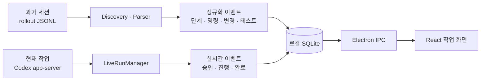

Codex 작업은 결과만 보면 흐름을 놓치기 쉽다. 어떤 명령을 실행했고, 어느 파일을 바꿨으며, 승인 요청에서 왜 멈췄는지가 여러 기록에 흩어진다. A_eye는 이 정보를 Windows 데스크톱 앱 한곳에서 읽고 제어하려고 만든 프로젝트다.

핵심 난제는 과거 기록과 현재 작업의 형식이 다르다는 점이었다. 과거 세션은 JSONL 파일로 남지만, 실행 중인 작업은 app-server 이벤트로 들어온다. 두 입력을 억지로 같은 방식으로 읽지 않고, 저장 직전에 공통 모델로 합쳤다.

*작성자 정리. A_eye의 기록 재생과 실시간 제어 경로.*

## 로그를 화면에 그대로 뿌리지 않은 이유

rollout JSONL에는 대화뿐 아니라 명령 실행, 파일 변경, 테스트, 토큰 사용량이 섞여 있다. [`rolloutParser.ts`](https://github.com/dorec9/A_eye/blob/50e80e45c6c6ec608e4ae6d9d1df6557bb1ec0c0/src/main/rolloutParser.ts)는 이를 이벤트로 분류한다. `stageEngine.ts`는 연속 이벤트를 계획, 구현, 검증 같은 단계로 묶는다. 원문 목록을 사람이 읽을 수 있는 작업 타임라인으로 바꾸는 구간이다.

파서는 입력 크기에도 상한을 둔다. 5MB를 넘는 rollout은 전체 내용을 자동 분석하지 않고 메타데이터만 등록한다. 한 줄은 최대 500만 자, 문자열은 2만 자, 배열은 120개까지만 보존한다. 시작할 때 오래된 대형 로그를 모두 파싱해 화면이 늦게 뜨는 문제를 막기 위한 선택이다.

변경이 없는 파일은 SHA-256, 크기, 수정 시각을 비교해 다시 읽지 않는다. 이 방식은 파일 수가 늘어날수록 효과가 커진다. 새 파일과 변경 파일은 chokidar가 감지하고, 800ms 지연 후 재스캔해 연속 저장도 한 번으로 모은다.

## 조회 도구에서 작업 관제 도구로 넓혔다

첫 커밋은 로컬 세션을 읽는 MVP였다. 다음 커밋에서는 app-server 연결, 프로젝트 선택, 작업 시작·추가 지시·중단·재개, 승인 처리를 붙였다. [Codex app-server 공식 문서](https://developers.openai.com/codex/app-server/)는 인증, 대화 기록, 승인, 스트리밍 이벤트를 제품에 연결하는 인터페이스로 설명한다. 기본 전송은 stdio의 JSONL이며, 연결마다 `initialize` 절차를 먼저 거친다.

A_eye는 `thread/start`와 `turn/start`로 작업을 시작한다. 이후 명령 실행과 파일 변경 알림을 feed에 쌓는다. 실행 승인이 필요하면 상태를 `waiting-approval`로 바꾸고 사용자의 결정을 app-server에 돌려준다. 앱을 다시 열었을 때 진행 중 thread에 재연결하는 경로도 별도로 뒀다.

여기서 SQLite는 단순 캐시가 아니다. 세션, 이벤트, 단계, 명령, 파일 변경, 테스트, 실시간 작업, 승인 요청을 관계로 묶는 기준점이다. [`node:sqlite`의 DatabaseSync](https://nodejs.org/api/sqlite.html#class-databasesync)는 단일 연결에서 동기식으로 동작한다. 로컬 단일 사용자 앱이라는 조건에서는 구현 복잡도를 낮추는 쪽이 더 중요했다.

## Electron의 경계는 기능보다 먼저 정했다

파일과 프로세스 접근은 Electron main 프로세스에만 뒀다. React renderer는 `nodeIntegration: false`, `contextIsolation: true`, `sandbox: true`로 실행한다. 필요한 기능만 preload의 메서드로 노출한다. [Electron의 Context Isolation 지침](https://www.electronjs.org/docs/latest/tutorial/context-isolation)은 `ipcRenderer` 전체를 넘기지 말고 IPC 메시지마다 제한된 메서드를 제공하라고 권고한다. A_eye도 세션 조회, 작업 시작, 승인 결정처럼 목적이 정해진 호출만 bridge에 올렸다.

이 경계 덕분에 UI는 파일 경로나 프로세스 권한을 직접 갖지 않는다. 민감한 출력은 저장 전에 마스킹하고, SQLite 파일도 앱의 `userData`에 둔다. 세션 원문과 요약을 외부 LLM으로 보내지 않는 것도 같은 판단이다.

현재 커밋에서는 파서, 단계 추론, 패치 분석, 비밀정보 마스킹, SQLite 저장 등을 다루는 8개 테스트 파일의 15개 테스트가 통과한다. 빌드와 린트도 통과한다. A_eye에서 얻은 결론은 관제 화면의 핵심이 화려한 대시보드가 아니라는 점이다. 기록과 실시간 이벤트를 같은 증거 구조로 저장하고, 권한 경계를 먼저 고정해야 작업 흐름을 믿고 읽을 수 있다.
