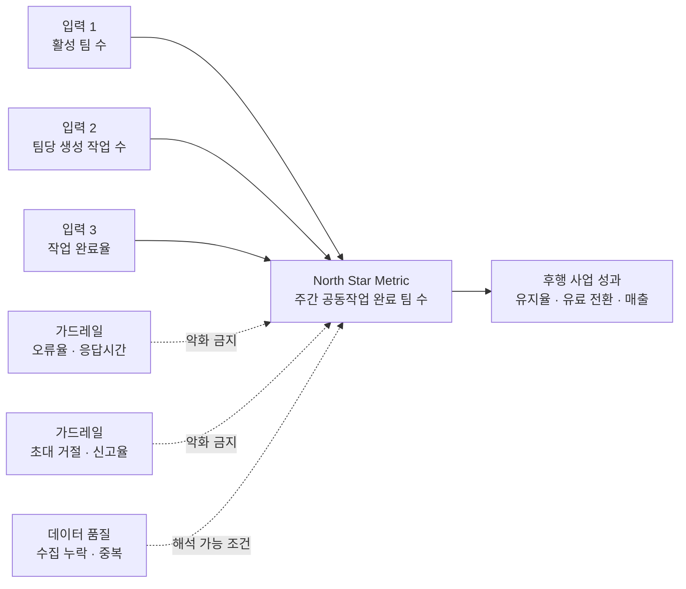

가입자 수가 20% 늘었는데 핵심 기능 사용률과 재방문율이 떨어질 수 있다. 매출만 보면 성장이지만 고객이 얻는 가치는 약해진 상태다. 지표 대시보드는 숫자를 많이 모으는 화면이 아니라, 무엇을 늘리고 무엇은 훼손하지 않을지 보여주는 의사결정 구조여야 한다.

North Star Metric(NSM)은 제품이 고객에게 전달한 핵심 가치를 대표하는 단일 지표다. [Amplitude의 North Star Framework](https://amplitude.com/books/north-star/about-north-star-framework)는 NSM을 고객 가치와 장기 사업 성과를 연결하는 선행지표로 설명한다. 팀이 직접 움직일 수 있는 3~5개 입력 지표가 NSM을 만든다.

## 지표를 네 층으로 연결한다

협업 SaaS를 예로 들어 NSM을 `주간 공동작업 완료 팀 수`로 잡아보자. 단순 로그인보다 여러 사용자가 실제 업무를 끝냈다는 가치를 담는다. 아래 구조는 가상의 설계 예시이며 기업 실적이 아니다.

*작성자 정리. NSM은 결과이고, 입력 지표는 팀이 움직일 수 있는 수단이다.*

대시보드의 첫 줄에는 NSM과 추세를 둔다. 둘째 줄에는 NSM을 분해한 입력 지표를 둔다. 셋째 줄에는 성능·신뢰성·사용자 피해를 감시하는 가드레일을 둔다. 마지막에는 지표 이상을 설명할 세그먼트와 데이터 품질을 둔다.

입력 지표와 NSM의 관계는 검증 가능한 가설이어야 한다. [Amplitude의 지표 정의 안내](https://amplitude.com/books/north-star/defining-your-North-Star)는 입력 지표를 팀이 직접 영향을 줄 수 있는 선행요인으로 정의한다. `알림 발송 수`처럼 활동량만 늘릴 수 있는 지표보다 `알림을 받고 공동작업을 완료한 팀 비율`처럼 가치 전달에 가까운 지표가 낫다.

## 가드레일은 성공 지표의 반대편에 둔다

가드레일 지표는 개선 목표가 아니다. 성장 실험이나 기능 변경이 제품의 다른 건강 상태를 허용 범위 이상 해치지 않는지 감시한다. [Microsoft Research의 지표 분류](https://www.microsoft.com/en-us/research/?p=720145)(2020년)는 페이지 응답시간, 충돌률, 이탈률을 대표 사례로 제시한다.

| 지표 역할 | 대시보드 질문 | 협업 SaaS 예시 | 운영 규칙 |
|---|---|---|---|
| NSM | 고객가치가 늘었는가 | 주간 공동작업 완료 팀 수 | 주간·월간 추세 확인 |
| 입력 | 무엇이 변화를 만들었는가 | 활성 팀, 작업 수, 완료율 | 담당 팀과 개선 가설 연결 |
| 가드레일 | 무엇을 희생했는가 | 오류율, P95 응답시간, 신고율 | 허용 한계 초과 시 중단·원인 분석 |
| 진단 | 어느 집단에서 움직였는가 | 신규·기존, 요금제, 기기 | 전체 평균과 함께 분해 |
| 품질 | 숫자를 믿을 수 있는가 | 이벤트 누락률, 중복률 | 이상 시 성과 판단 보류 |

가드레일마다 방향과 허용 한계를 먼저 정한다. 예를 들어 `P95 응답시간이 기준 대비 10% 넘게 악화되면 출시 보류`처럼 쓴다. 실험 결과를 본 뒤 한계를 정하면 유리한 결론에 맞추기 쉽다. [Spotify의 실험 의사결정 방식](https://engineering.atspotify.com/2024/3/risk-aware-product-decisions-in-a-b-tests-with-multiple-metrics)(2024년)은 성공 지표의 우월성과 모든 가드레일의 비열등성을 함께 확인한다.

## 지표 정의서를 대시보드보다 먼저 만든다

같은 `활성 팀`도 사람이 다르면 수치가 달라진다. 조회 기간, 분자·분모, 중복 제거 단위, 시간대, 제외 조건을 정의서에 고정한다. 지표마다 소유자와 갱신 주기, 원천 테이블, 허용 지연도 기록한다.

사용자 경험은 로그 한 종류로 설명되지 않는다. [Google의 HEART 연구](https://research.google/pubs/measuring-the-user-experience-on-a-large-scale-user-centered-metrics-for-web-applications/)(2010년)는 목표를 신호와 지표에 연결하고, 만족도와 행동 데이터를 함께 보도록 제안한다. NSM이 올라도 오류율이나 만족도가 나빠지면 지속 가능한 개선으로 보기 어렵다.

화면에는 모든 지표를 같은 크기로 놓지 않는다. NSM은 방향, 입력 지표는 행동, 가드레일은 중단 조건, 진단 지표는 원인을 담당한다. 이 네 역할을 분리하면 대시보드가 보고용 숫자판에서 실행 우선순위를 정하는 도구로 바뀐다.
