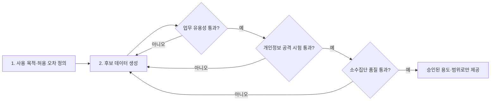

합성데이터는 실제 데이터의 통계적 특성을 학습해 새로 만든 인공 데이터다. 원본 행을 지웠다는 이유만으로 개인정보 문제가 해결되지는 않는다. 생성 모델이 희귀한 개인의 특성을 외우면 특정 사람이 학습 데이터에 있었는지 추론할 수 있고, 보호를 강하게 걸면 소수집단의 패턴이 사라져 모델 성능이 낮아질 수 있다.

[영국 정부의 합성데이터 안내](https://www.gov.uk/government/publications/ai-insights/ai-insights-synthetic-data-html)는 합성데이터도 편향과 개인정보 위험에서 자유롭지 않으며 실제 데이터와 같은 수준의 엄격한 검증이 필요하다고 설명한다. 도입 판단은 “실제처럼 보이는가”가 아니라 **정해진 업무에서 쓸 만큼 정확한가, 개인을 추론하기 어려운가, 특정 집단의 오류가 커지지 않는가**라는 세 질문으로 시작해야 한다.

## 용도를 고정해야 합격 기준이 생긴다

분석가 교육용 샘플, 소프트웨어 테스트, 외부 공유, 예측모델 학습은 허용할 위험이 다르다. 화면 테스트용 데이터는 컬럼 형식과 예외값 재현이 중요하지만, 신용평가 모델 학습용 데이터는 집단별 순위와 결과 예측력이 중요하다. 외부 공개라면 내부 분석보다 더 높은 개인정보 보호 수준이 필요하다.

[영국 통계청 ONS의 SynthGauge](https://datasciencecampus.ons.gov.uk/evaluating-synthetic-data-using-synthgauge/)(2022년 기준)는 유용성과 개인정보 위험을 함께 측정하되 모든 목적에 맞는 단일 점수는 없다고 설명한다. 따라서 생성 전에 사용 목적, 허용 오차, 공개 범위, 실패 시 피해를 한 장으로 정한다. 이 기준이 없으면 분포 유사도가 높다는 결과만으로 승인하게 된다.

*작성자 정리. 어느 한 관문이라도 실패하면 생성 방식이나 사용 범위를 조정해 다시 검증한다.*

## 유용성은 분포보다 실제 업무로 검증한다

첫 단계에서는 각 변수의 평균·분산·범주 비율을 원본과 비교한다. 다음으로 변수 간 상관관계, 조건부 분포, 시계열 순서처럼 업무 판단에 영향을 주는 관계를 확인한다. 마지막에는 합성데이터로 학습한 모델을 별도로 보관한 실제 데이터에서 평가한다. 이때 정확도 하나만 보지 않고 정밀도·재현율·보정 오차 등 기존 업무 지표와 같은 기준을 쓴다.

전체 평균이 비슷해도 희귀 질환, 소액 연체, 지역별 소수 고객처럼 표본이 작은 집단은 누락될 수 있다. [유럽 개인정보보호감독기구의 설명](https://www.edps.europa.eu/press-publications/publications/techsonar/synthetic-data_fr)은 합성 과정에서 이상치가 사라질 수 있고 원본과 생성 모델의 편향이 이어질 수 있다고 지적한다. 전체와 주요 하위집단의 오차를 따로 적고, 합격선은 실제 데이터 기준선과 비교해야 한다.

| 검증 관문 | 핵심 시험 | 통과 기준 예시 | 실패 시 조치 |
|---|---|---|---|
| 구조 | 자료형, 범위, 결측·중복 | 스키마와 업무 규칙 충족 | 생성 제약조건 수정 |
| 통계 | 분포, 상관, 조건부 관계 | 사전 정의한 거리·오차 이내 | 모델·학습 변수 조정 |
| 업무 | 실제 검증셋에서 모델 평가 | 기준 모델 대비 허용 하락 이내 | 용도 축소 또는 재생성 |
| 개인정보 | 중복, 최근접 거리, 멤버십·속성 추론 | 공격 성공률이 승인 한도 이하 | 보호기법 강화·공개 금지 |
| 공정성 | 집단별 성능과 대표성 | 핵심 집단별 허용 격차 이내 | 표본·가중치·목표 재설계 |

*작성자 정리. 실제 수치 한도는 데이터 민감도와 업무 손실을 반영해 승인 전에 정한다.*

## 개인정보 위험은 공격해 봐야 드러난다

원본과 완전히 같은 행, 지나치게 가까운 행, 희귀 속성 조합부터 찾는다. 이어서 특정 개인이 원본에 포함됐는지 맞히는 멤버십 추론과 알려진 속성으로 민감 속성을 맞히는 속성 추론을 실행한다. [영국 ICO의 AI 데이터 최소화 지침](https://ico.org.uk/for-organisations/uk-gdpr-guidance-and-resources/artificial-intelligence/guidance-on-ai-and-data-protection/how-should-we-assess-security-and-data-minimisation-in-ai/)도 희귀한 개인의 패턴이 합성데이터에 나타나면 멤버십 추론이 가능하다고 경고한다. 식별 가능한 사람과 연결할 수 없다는 점을 입증하기 전에는 합성데이터를 자동으로 익명정보로 분류해서는 안 된다.

외부 공개나 고위험 데이터처럼 수학적 보증이 필요하다면 차등프라이버시를 검토한다. 차등프라이버시는 한 사람의 데이터 포함 여부가 결과에 미치는 영향을 제한하는 방식이다. [NIST SP 800-226](https://www.nist.gov/publications/guidelines-evaluating-differential-privacy-guarantees)(2025년)은 차등프라이버시가 아닌 합성데이터의 보호 주장은 대체로 비공식적이며 개인정보 공격에 취약할 수 있다고 설명한다. 다만 보호를 위한 잡음은 작은 집단의 정확도와 불확실성에 영향을 주므로 개인정보 예산과 집단별 성능을 함께 공개해야 한다.

## 승인은 데이터가 아니라 사용 범위에 내린다

검증을 통과해도 모든 활용을 허용하는 것은 아니다. 생성기 버전, 원본 데이터 기간, 설정값, 유용성·공격 시험 결과, 승인 용도와 만료일을 기록한다. 합성데이터에는 등급과 접근권한을 붙이고, 목적이 바뀌거나 원본 분포가 이동하면 다시 시험한다. 원본 데이터는 생성과 독립 평가에 필요하므로 통제된 환경에 보관한다.

결론은 단순하다. 합성데이터의 가치는 원본을 닮은 정도가 아니라 정해진 의사결정을 유지하면서 개인정보 공격 가능성을 낮추는 데 있다. 유용성, 개인정보, 소수집단 품질 중 하나라도 측정하지 못한다면 도입 승인이 아니라 제한된 실험 단계에 머물러야 한다.
