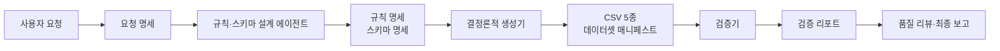

“주문 데이터를 현실적으로 만들어 달라”는 요청만으로는 결과를 검증하기 어렵다. 현실적이라는 말에 행 수, 상태 비율, 외래키, 시간 순서가 섞여 있기 때문이다. Data-Factory는 이 모호함을 먼저 JSON 계약으로 바꾸고, 생성과 검증을 스크립트에 맡기는 합성데이터 시스템이다.

최신 커밋 `592ab7b`의 기본 주문 예제를 실행했다. customers 25행, products 12행, orders·payments·shipments 각 60행으로 총 217행이 생성됐다. 검증기는 73개 항목을 통과했고 경고와 실패는 0건이었다. 같은 시드 42와 명세를 쓰면 같은 데이터와 SHA-256 체크섬을 다시 얻는다.

## 에이전트와 도구의 경계를 먼저 그었다

설계 원칙은 판단과 계산을 나누는 것이다. 에이전트는 요구사항 해석, 규칙 설계, 품질 해석, 보고를 맡는다. 행 생성, 무결성 검사, 통계 계산은 결정론적 도구가 맡는다. [멀티에이전트 아키텍처 문서](https://github.com/dorec9/Data-Factory/blob/592ab7b3eb9b86c8833448088fb3ff1da7ff3787/docs/architecture/data-factory-multi-agent-v1.md)는 이 경계를 입력·출력 아티팩트까지 고정한다.

*작성자 정리. 자연어 판단은 에이전트가, 반복 가능한 계산은 도구가 담당한다.*

한 에이전트가 요청부터 CSV까지 모두 만들면 중간 판단이 대화 안에만 남는다. Data-Factory는 `request_spec`, `rule_spec`, `schema_spec`, `simulation_plan`을 생성 전 계약으로 사용한다. 생성 뒤에는 `dataset_manifest`, `validation_report`, `refinement_plan`, `final_report`를 남긴다. 각 파일은 다음 단계의 입력이며, [JSON Schema 계약](https://github.com/dorec9/Data-Factory/tree/592ab7b3eb9b86c8833448088fb3ff1da7ff3787/schemas)으로 필수 필드와 허용값을 검사할 수 있다.

## 생성기는 시드뿐 아니라 관계를 재현한다

[simulation_executor.py](https://github.com/dorec9/Data-Factory/blob/592ab7b3eb9b86c8833448088fb3ff1da7ff3787/tools/simulation_executor.py)는 명세에 적힌 실행 순서대로 고객과 상품을 먼저 만든다. 주문은 존재하는 고객·상품 키를 참조한다. 결제와 배송은 주문 상태에서 파생된다. 완료 주문은 결제 완료와 배송 완료로 이어지고, 취소 주문은 무효 결제와 취소 배송으로 이어진다.

재현성은 난수 시드 하나로 끝나지 않는다. 결과 매니페스트에 엔터티별 행 수, 파일 경로, 형식, SHA-256 체크섬, 입력 명세 경로를 기록한다. 데이터 본문을 대화에 넣지 않아도 어떤 입력으로 어떤 결과가 나왔는지 추적할 수 있다.

기본 예제는 상품 범주와 주문 상태 비율도 규칙으로 선언한다. 생성기는 목표 비율을 행 수에 맞춰 할당한 뒤 섞는다. 이번 실행에서 주문 상태의 최대 비율 차이는 0.0033이었다. 무작위 표본에 기대는 방식보다 작은 데이터에서도 목표 분포를 안정적으로 재현한다.

## 품질은 “그럴듯함”을 검사 목록으로 바꿨다

[validation_runner.py](https://github.com/dorec9/Data-Factory/blob/592ab7b3eb9b86c8833448088fb3ff1da7ff3787/tools/validation_runner.py)는 스키마, 무결성, 상태, 시간, 분포, 업무 규칙을 나눠 검사한다. 기본 주문 예제의 핵심 검사는 다음과 같다.

| 검증 층 | 실제 확인 항목 | 막는 오류 |
|---|---|---|
| 스키마 | 필수·추가 컬럼, 행 수 | 계약과 다른 파일 구조 |
| 무결성 | 기본키, 고유값, 외래키, null | 고아 주문과 중복 식별자 |
| 상태 | 주문·결제·배송 허용 상태 | 정의되지 않은 상태값 |
| 시간 | 가입→주문→결제→배송 순서 | 원인보다 앞선 결과 |
| 업무 규칙 | 수량×단가, 결제액, 취소·완료 연계 | 테이블별로는 맞지만 함께 보면 틀린 데이터 |
| 분포 | 목표 범주와 관측 비율의 차이 | 한 범주로 치우친 표본 |

이 구조의 장점은 실패가 수정 지점으로 연결된다는 데 있다. 외래키 오류는 스키마나 생성 순서를, 분포 오류는 규칙 명세나 할당 방식을 고치면 된다. 품질 리뷰가 “더 현실적으로”라는 문장에 머물지 않고 상위 계약의 변경안이 된다.

## 웹 콘솔은 결과보다 근거를 보여준다

FastAPI 서비스는 예제 목록 조회, 실행 시작, 최근 실행 조회, 아티팩트와 샘플 열람을 제공한다. [웹 MVP 실행 지침](https://github.com/dorec9/Data-Factory/blob/592ab7b3eb9b86c8833448088fb3ff1da7ff3787/docs/runbooks/web-mvp-golden-path.md)은 한 화면에서 예제 선택, 생성·검증, 결과 요약, 과거 실행 재열람까지 이어지도록 범위를 정했다.

화면의 핵심 숫자는 생성 시간이 아니라 총 행 수, 엔터티 수, 통과·경고·실패 수다. 사용자는 매니페스트와 검증 리포트 원문도 바로 열 수 있다. 합성데이터 상품을 믿게 만드는 것은 화려한 샘플보다 재현 가능한 생성 이력과 읽을 수 있는 검사 근거라는 판단이다.

Data-Factory에서 얻은 결론은 멀티에이전트의 수가 품질을 결정하지 않는다는 점이다. 역할 사이에 검증 가능한 계약이 있고, 계산을 같은 조건으로 다시 실행할 수 있어야 한다. 합성데이터 공장은 에이전트 조직도보다 명세, 체크섬, 검증 리포트가 먼저다.
