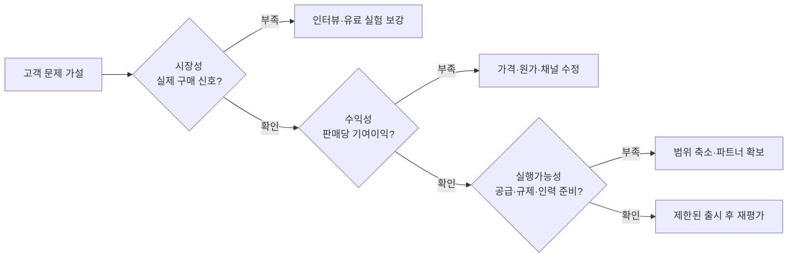

신사업 계획서에 시장 규모 1조 원과 3년 차 매출 100억 원이 적혀 있어도 투자 결정은 어렵다. 누가 지금 그 문제를 겪는지, 그 고객에게 팔수록 이익이 남는지, 조직이 약속한 품질로 공급할 수 있는지가 빠져 있기 때문이다. 세 질문을 한 번에 점수화하면 치명적인 결함이 높은 시장 점수에 가려진다. **시장성, 수익성, 실행가능성은 각각 통과해야 하는 관문**으로 다루는 편이 낫다.

[영국 재무부의 2026년 Green Book](https://www.gov.uk/government/publications/the-green-book-appraisal-and-evaluation-in-central-government/the-green-book-2026)은 사업 제안을 전략, 경제, 상업, 재무, 관리의 연결된 관점에서 검토한다. 아래 세 관문은 이를 민간 신사업의 초기 의사결정에 맞게 압축한 실무 틀이다. 공공사업의 사회적 편익 평가와 기업의 이익 평가는 목적이 다르므로 숫자 기준을 그대로 옮기지는 않는다.

*작성자 정리. 한 관문의 실패는 전체 평균 점수로 상쇄하지 않는다.*

## 첫째, 시장성은 고객의 행동으로 확인한다

시장 규모 추정은 진입 가능한 고객의 상한을 잡는 도구다. 실제 수요의 증거는 아니다. 먼저 고객을 직무·상황별로 나누고, 현재 어떤 대안에 시간과 돈을 쓰는지 조사한다. 구매자와 사용자가 다르면 두 사람의 승인 조건도 따로 확인한다.

[미국 국립과학재단 NSF의 I-Corps 안내](https://www.nsf.gov/funding/initiatives/i-corps/about-teams)는 잠재 고객, 파트너, 업계 관계자와의 직접 대화를 상업화 가능성 검증의 중심에 둔다. 인터뷰에서는 “살 의향이 있나”보다 최근 문제 발생 사례, 현재 지출, 구매 절차를 묻는다. 그다음 소액 선결제, 유료 파일럿, 도입 의향서처럼 비용이 따르는 행동으로 가설을 시험한다. 의향서는 계약 매출과 구분해 기록한다.

이 관문의 통과 기준은 사전에 정한다. 예를 들어 특정 고객군에서 문제의 반복 빈도, 구매권자의 예산, 유료 실험 전환율을 정의한다. 표본과 모집 경로까지 남겨야 지인의 호의적인 응답을 시장 전체로 확대하지 않는다.

## 둘째, 수익성은 손익과 현금을 함께 본다

수익성 검토에서는 예상 매출을 `유료 고객 수 × 고객당 매출`로 쪼갠다. 고객 수는 접촉 가능한 시장, 전환율, 영업 기간으로 다시 검증한다. 매출총이익만 볼 것이 아니라 판매 수수료, 도입 지원, 고객 유지비 같은 변동비를 뺀 기여이익을 계산한다. 고객획득비용을 회수하기 전까지 필요한 운전자금도 따로 본다.

[미국 중소기업청 SBA의 사업계획 지침](https://legacy.sba.gov/business-guide/plan-your-business/write-your-business-plan)은 매출 전망과 함께 손익계산서, 현금흐름표, 자본 지출 예산을 요구한다. 초기 사업에서는 이익이 나더라도 대금 회수가 늦으면 현금이 부족해질 수 있다. 기준 시나리오뿐 아니라 가격 하락, 전환율 저하, 회수 기간 연장을 반영한 보수 시나리오를 붙인다.

수치의 정확도를 꾸미지 않는다. 인터뷰에서 관측한 값, 계약서로 확인한 값, 아직 가정인 값을 다른 색이나 열로 구분한다. 손익분기점이 오직 낙관 시나리오에서만 성립한다면 승인보다 추가 실험이 맞다.

## 셋째, 실행가능성은 첫 고객에게 인도할 능력이다

제품을 만들 수 있다는 사실과 고객에게 반복 공급할 수 있다는 사실은 다르다. 필요한 인력, 공급처, 인허가, 데이터 사용권, 고객 지원, 장애 대응을 출시 단위로 점검한다. [Green Book의 관리 관점](https://www.gov.uk/government/publications/the-green-book-appraisal-and-evaluation-in-central-government/the-green-book-2026)은 일정, 책임, 위험 관리와 실제 인도 능력을 사업 판단에 포함한다. 민간 사업에서도 핵심 공급처 하나가 빠졌을 때 대체 경로가 있는지 확인해야 한다.

| 관문 | 제출할 증거 | 중단·보완 신호 |
|---|---|---|
| 시장성 | 고객군별 인터뷰, 현재 대안, 유료 실험 | 구매권자·예산이 불명확함 |
| 수익성 | 가격·변동비·획득비·현금흐름 시나리오 | 팔수록 손실이 늘거나 현금 부족 |
| 실행가능성 | 인력·공급·권리·규제·운영 책임표 | 필수 자원 확보 경로가 없음 |

게이트 회의에는 세 관문별로 `통과`, `조건부`, `중단`을 따로 적는다. 조건부라면 다음 투자금으로 무엇을 몇 주 안에 검증할지 명시한다. 시장성을 확인했지만 공급이 막힌 사업은 출시 범위를 줄일 수 있다. 수익성이 검증되지 않은 사업은 기능 개발보다 가격과 원가 실험이 먼저다. 이렇게 하면 신사업 검토가 전망 숫자를 승인하는 자리가 아니라 다음 불확실성을 제거할 자원을 배분하는 결정이 된다.
