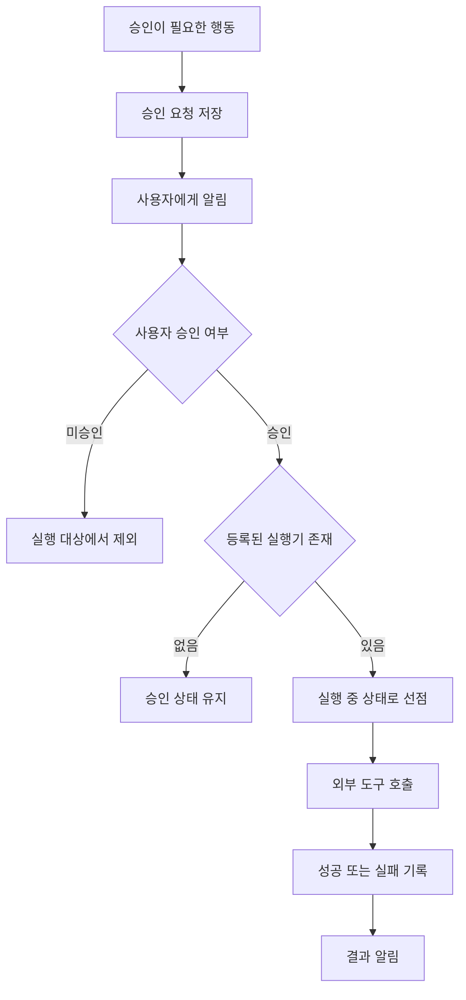

일정 초대를 발견하는 것과 수락하는 것은 다른 일이다. 전자는 정보를 읽는 작업이고, 후자는 상대와 약속을 확정하는 작업이다. 개인 비서 my-agent의 초기 승인 실행 계층에서는 이 둘 사이에 **승인 기록과 실행 상태**를 두었다. 모델이 제안한 행동이 어떤 경로로 실제 작업이 되는지를 코드로 제한하기 위해서다.

## 승인 버튼보다 먼저 저장 순서를 정했다

승인 요청을 만드는 `ApprovalCoordinator`는 요청을 저장한 뒤 알림을 보낸다. 저장소가 고유한 승인 ID를 받아들여야 다음 단계로 넘어간다. 알림 전송이 실패하면 승인 요청을 없애지 않고, 알림 오류를 별도로 기록한다.

이 순서의 장점은 사용자에게 보이는 메시지와 작업의 원본을 구분한다는 데 있다. 알림은 승인 요청이 존재한다는 신호다. 알림을 다시 보낼 일이 생겨도 승인 여부를 판단할 기준은 저장된 요청에 남는다. 요청에는 제안된 행동, 승인 필요 사유, 요청 시각과 상태가 함께 들어간다.

*도식: 초기 승인 실행 계층의 코드 흐름을 재구성한 작성자 정리.*

그림에서 눈여겨볼 곳은 승인 뒤의 분기다. 승인을 받았다는 이유만으로 모든 도구를 호출할 수 있게 만들지는 않았다.

## 승인과 실행 권한을 두 번 나눴다

`ApprovalExecutor`는 승인된 요청을 읽고 행동 종류에 연결된 실행기를 찾는다. 실행기는 특정 행동을 실제 API 호출로 바꾸는 함수다. 연결된 실행기가 없으면 건너뛰고 승인 상태를 유지한다. 지원서 제출이나 메일 발송을 승인했다고 해서, 아직 연결하지 않은 기능이 임의로 실행되지는 않는다.

실행기가 있으면 저장소에 요청을 선점한다. 선점은 다른 실행자가 같은 요청을 가져가지 않도록 상태를 ‘승인됨’에서 ‘실행 중’으로 바꾸는 과정이다. 살펴본 Firestore 구현은 트랜잭션에서 현재 상태를 확인한 뒤 변경한다. [Firestore 공식 문서](https://docs.cloud.google.com/firestore/native/docs/manage-data/transactions)는 동시 수정이 있으면 트랜잭션 함수가 다시 실행될 수 있다고 설명한다. 따라서 외부 API 호출은 그 함수 밖에 두었다.

여기서 보장 범위를 구분해야 한다. 상태 선점은 중복 실행을 막는 장치지만, 데이터베이스와 외부 서비스의 변경을 하나의 원자적 작업으로 묶지는 않는다. 외부 변경 결과가 불확실할 때는 동일 요청을 무조건 재실행하기보다 실제 상태를 확인하는 절차가 필요하다. 이것은 외부 시스템을 다루는 승인 설계의 공통 경계다.

## 일정 수락은 기존 상태를 읽고 바꾼다

일정 초대 수락 함수는 먼저 해당 이벤트를 조회한다. 참석자 중 본인 항목을 찾고, 이미 수락된 상태라면 수정 호출 없이 이벤트 ID를 반환한다. 아직 수락하지 않았을 때만 응답 상태를 변경한다.

[Google Calendar의 이벤트 수정 문서](https://developers.google.com/workspace/calendar/api/v3/reference/events/patch)는 지정한 필드가 기존 값을 대체하며, 배열은 기존 배열을 덮어쓸 수 있다고 설명한다. 그래서 일정 변경은 ‘수락’이라는 동사 하나로 끝나지 않는다. 어떤 참석자의 어떤 상태를 바꾸는지까지 도구 구현이 책임져야 한다. 모델은 의도를 제안하고, 실행 코드는 변경 범위를 좁힌다.

## 실제 계정 대신 가짜 저장소로 경계를 검증했다

저장소와 알림기는 Python의 `Protocol`로 필요한 메서드를 정의했다. [Python 공식 문서의 Protocol 설명](https://docs.python.org/3/library/typing.html#typing.Protocol)처럼 같은 구조를 갖춘 구현을 받아들이는 방식이다. 테스트에서는 실제 클라우드 저장소 대신 메모리 안의 가짜 저장소를 넣었다. Protocol 자체가 런타임 권한 검사나 동시성 제어를 해 주는 것은 아니다.

이번 회고에서 고정 커밋의 승인 실행·알림·일정 승인·Calendar 단위 테스트 네 파일을 실행했고, **15개가 통과했다**. 아래는 그중 설계 판단과 직접 연결되는 확인 항목이다.

| 테스트 상황 | 확인한 결과 |
|---|---|
| 일정 수락과 미등록 행동이 함께 승인됨 | 등록된 일정 실행기만 호출 |
| 완료 뒤 실행 루프를 다시 호출 | 완료 요청은 다시 실행되지 않음 |
| 실행기가 예외를 반환 | 실패 상태와 오류를 기록하고 알림 |
| 대기 상태가 아닌 요청을 승인 알림기에 전달 | 요청 거부 |

*표: 격리된 코드 복사본에서 수행한 단위 테스트 결과. 실제 계정 연동이나 운영 장애 복구 전체를 검증한 결과는 아니다.*

이 구조에서 얻은 설계 기준은 세 가지다. 알림보다 원본 상태를 먼저 남긴다. 승인받은 행동도 등록된 도구 범위 안에서 실행한다. 작업 결과와 결과 알림의 성공 여부를 구분한다. **개인 비서의 신뢰는 답변 문장뿐 아니라, 실행 전후에 무엇을 기록하고 제한하는지에서 만들어진다.** 기능을 늘릴 때도 새 실행기와 경계 테스트를 함께 추가하는 기준으로 삼을 수 있다.
